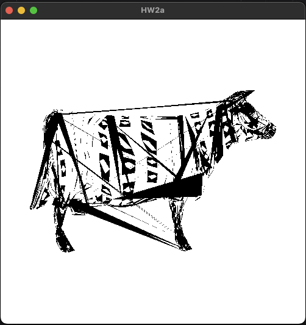

# Assignment 2A

# Building
```
$ cmake .
$ make
```


# Usage
`$ ./HW2a`
- Use the arrow keys to scale the model.
- Use the mouse button + mouse movement left and right to rotate the model.
- Use the ctrl key + mouse button + mouse movement to translate the model.
- Use the shift key + mouse button + mouse movement to rotate the triangles as individual limbs.

# Showcase
### Base assignment
https://github.com/blipson/fundamentals-of-computer-graphics/assets/4571819/2aac9e89-9e82-491d-8c60-97b57c537eb2

### Rendering from a .obj file

- **Please note that most `.obj` files are defined in 3D space so rendering them in 2D can make them look like segments are missing. This is normal, expected behavior.**

### Rotating individual limbs
https://github.com/blipson/fundamentals-of-computer-graphics/assets/4571819/02818a5b-3192-4a5f-8901-2653c37c9b3a


# Grading Criteria
- The program correctly recognizes when one of the arrow keys has been pressed, and an
  attempt is made in the code to respond appropriately (such as by updating a variable that is
  intended to control the scaling of the model). (5 pts)
- ```c++
  static void key_callback(GLFWwindow* window, int key, int scancode, int action, int mods) {
    if (key == GLFW_KEY_ESCAPE && action == GLFW_PRESS) {
        glfwSetWindowShouldClose(window, GL_TRUE);
    }

    switch (key) {
        case GLFW_KEY_LEFT:
            state.operation = SCALE;
            if (state.scaleFactorX > 0.01) {
                state.scaleFactorX *= 0.9;
            }
            break;
        case GLFW_KEY_RIGHT:
            state.operation = SCALE;
            state.scaleFactorX *= 1.1;
            break;
        case GLFW_KEY_UP:
            state.operation = SCALE;
            state.scaleFactorY *= 1.1;
            break;
        case GLFW_KEY_DOWN:
            state.operation = SCALE;
            if (state.scaleFactorY > 0.01) {
                state.scaleFactorY *= 0.9;
            }
            break;
        case GLFW_KEY_R:
            state.operation = RESET;
            resetMatrix();
            break;
        case GLFW_KEY_Q:
            glfwSetWindowShouldClose(window, GL_TRUE);
            break;
        default:
            break;
    }
  }
  ```
- The program successfully enables the user to separately adjust the intrinsic width and
  height of a 2D geometric object according to input provided via the keyboard. The rate of the
  scaling change is reasonable: the object does not get too big or too small “too fast”, and it never
  flips over as a result of scaling commands. Although it is allowable for extreme scaling to result
  in some objects becoming too small to see, the program prevents the model from entering a state
  from which recovery (short of a full reset) is impossible. (10 pts)
  - See above.
- Re-sizing the object does not cause a noticeable shift in the object’s central position
  within the display window. Re-sizing is always applied with respect to the model’s intrinsic
  horizontal and vertical axes. Pressing the left arrow key always causes the object to become
  thinner, and pressing the right arrow key always causes it to become wider, with respect to its
  original state; likewise pressing the up arrow key always causes the object to become taller and
  pressing the down arrow key always causes the object to become shorter. This specified scaling
  behavior occurs irrespectively of the orientation or position of the object in the viewing window.
  (10 pts)
  - See above.
- The program is capable of sensing the movement of the cursor and interpreting it
  appropriately. Cursor movement doesn’t cause a change to the model’s position or orientation
  until/unless the user signals (e.g. via a button press) that they are intending to use the cursor to
  rotate or translate the model. The program is able to successfully differentiate between when the
  user is seeking to change the object’s position versus its orientation. For instance, when the
  ‘control’ key (or an appropriate alternative) is pressed at the same time as the left mouse button
  (or equivalent) is pressed, the program attempts to use the movement of the cursor to modify
  parameters pertaining to the object’s position; if the ‘control’ key (or its designated alternative) is
  not pressed at the same time as the left mouse button (or equivalent) is pressed, or if a designated
  alternative key is pressed, the program attempts to use the cursor’s movement to modify
  parameters pertaining to the object’s rotation. (5 pts)
  - ```c++
    
    static void mouse_button_callback(GLFWwindow* window, int button, int action, int mods) {
        glfwGetCursorPos(window, &state.mouseX, &state.mouseY);
        if (button == GLFW_MOUSE_BUTTON_LEFT && action == GLFW_PRESS && mods != GLFW_MOD_CONTROL && mods != GLFW_MOD_SHIFT) {
            state.operation = ROTATE;
        } else if (button == GLFW_MOUSE_BUTTON_LEFT && action == GLFW_RELEASE) {
            state.operation = BASE;
        } else if (button == GLFW_MOUSE_BUTTON_LEFT && mods == GLFW_MOD_CONTROL) {
            state.operation = TRANSLATE;
        } else if (button == GLFW_MOUSE_BUTTON_LEFT && mods == GLFW_MOD_SHIFT) {
            state.operation = ROTATE_LIMB;
        }
    }
    
    static void cursor_pos_callback(GLFWwindow* window, double xPos, double yPos) {
      double dx = xPos - state.previousMouseX;
      double dy = yPos - state.previousMouseY;
      state.previousMouseX = xPos;
      state.previousMouseY = yPos;
      if (xPos < 0 || xPos > window_width || yPos < 0 || yPos > window_height) {
          return;
      }
      if (state.operation == ROTATE) {
          state.rotationAngle += 2.0f * (float) dx / (float) window_width * pi;
          if (state.rotationAngle > 2 * pi) {
              state.rotationAngle -= 2 * pi;
          }
          else if (state.rotationAngle < - 2 * pi) {
              state.rotationAngle += 2 * pi;
          }
      } else if (state.operation == ROTATE_LIMB) {
          state.limbRotationAngle += 2.0f * (float) dx / (float) window_width * pi;
          if (state.limbRotationAngle > 2 * pi) {
              state.limbRotationAngle -= 2 * pi;
          } else if (state.limbRotationAngle < - 2 * pi) {
              state.limbRotationAngle += 2 * pi;
          }
      } else if (state.operation == TRANSLATE) {
          if ((dx > 0 && state.translateX < 0.99) || (dx < 0 && state.translateX > -0.99)) {
              state.translateX += (float) dx / ((float) window_width/ 2);
          }
          if ((dy < 0 && state.translateY < 0.99) || (dy > 0 && state.translateY > -0.99)) {
              state.translateY += -((float) dy) / ((float) window_height / 2);
          }
      }
    }
    ```
- The program successfully enables the user to interactively rotate a 2D geometric object
  via user-controlled cursor motion. The mapping between the amount of cursor movement and
  the amount of object rotation is reasonable (i.e. a small amount of cursor movement leads to a
  small amount of rotation and larger amounts of cursor movement cause larger amounts of object
  rotation). In particular, the entire object should not spin around more than once or twice for an
  amount of cursor motion that is comfortable to achieve in one continuous movement. (10 pts)
  - See above.
- If the original provided model is used, it always rotates about its centroid; if an imported
  model is used, it always rotates about a point whose location is fixed with respect to that model.
  A clear and consistent relationship between cursor movement and object rotation is enforced.
  When the cursor moves a small amount to the right, the object rotates by a small amount in the
  clockwise direction; when the cursor moves a small amount to the left, the object rotates by a
  small amount in the counterclockwise direction. Up and down movements of the cursor (within
  reason) should not change the rotational state of the object. This specified behavior occurs
  irrespective of the position of the object within the viewing window and irrespective of its
  orientation. Specifically, the object never rotates clockwise when the mouse moves left, or
  counter-clockwise when the mouse moves right, and it never spins in an arc whose radius
  depends on the position of the object with respect to the display window. (20 pts)
  - See above.
- The program successfully enables the user to interactively reposition a 2D geometric
  object within a display window via user-controlled cursor motion in conjunction with an
  appropriate key press. (10 pts)
  - See above.
- While the object is being re-positioned, its movement follows the cursor movement
  relatively faithfully: when the cursor moves in a given direction, the object moves in that same
  direction; when the cursor moves by a given amount, the object moves by a roughly similar
  amount. This behavior is maintained irrespective of the scale of the object or its orientation
  within the viewing window (15 pts)
  - The order is correctly defined
  - ```c++
    // apply global scaling
    limbGlobalScalingMatrix[0] = state.scaleFactorX;
    limbGlobalScalingMatrix[5] = state.scaleFactorY;
    multiplyMatrices(limbGlobalScalingApplied, limbTranslationBackApplied, limbGlobalScalingMatrix);

    // apply global rotation
    GLfloat globalCosTheta = cos(state.rotationAngle);
    GLfloat globalSinTheta = sin(state.rotationAngle);
    limbGlobalRotationMatrix[0] = globalCosTheta;
    limbGlobalRotationMatrix[1] = -globalSinTheta;
    limbGlobalRotationMatrix[4] = globalSinTheta;
    limbGlobalRotationMatrix[5] = globalCosTheta;
    multiplyMatrices(limbGlobalRotationApplied, limbGlobalRotationMatrix, limbGlobalScalingApplied);

    // apply global translation
    for (int j = 0; j < 16; j++) {
        if (j == 12) {
            limbGlobalTranslationApplied[j] = limbGlobalRotationApplied[j] + state.translateX;
        } else if (j == 13) {
            limbGlobalTranslationApplied[j] = limbGlobalRotationApplied[j] + state.translateY;
        } else {
            limbGlobalTranslationApplied[j] = limbGlobalRotationApplied[j];
        }
    }
    ```
- The program prevents the user from entering a failure state in which the window appears
  empty because the object has been completely moved to an unseen location off screen. Although
  parts of the object can be “clipped” by the edges of the screen, some portion of the object always
  remains visible within the display window. (5 pts)
  - See above.
- The program includes a keypress option that allows resetting the state of the geometric
  transformations, so that the object returns to its original size and position, from which it can be
  manipulated again as before. (5 pts)
  - ```c++
    void resetMatrix() {
        state.previousMouseX = 0.0;
        state.previousMouseY = 0.0;
        state.rotationAngle = 0.0;
        state.limbRotationAngle = 0.0;
        state.scaleFactorX = 1.0;
        state.scaleFactorY = 1.0;
        state.translateX = 0.0;
        state.translateY = 0.0;
    }
    ```
- The program is reasonably well-written and well-structured; comments are used to
  explain what is going on at various critical stages in the code, and there are no glaring
  inefficiencies in the implementation. The code is written in a platform-independent manner and
  is straightforward to compile given the students’ provided instructions/makefiles. The execution
  of the program is robust; there are no unexpected glitches in performance. The student has turned
  in all of their source code, along with appropriate images to demonstrate the successful
  performance of their program. (5 pts)

#### Extra Credit:
- The student has provided an image showing that their program uses a different 2D model
  than the one provided in the template code. The student’s model is creative and original, and
  differs in meaningful ways from the model that was provided. Specifically: the student has not
  simply commented out parts of the original geometry but has substituted new geometry that
  represents a step beyond what was there before. (3 pts) OR The submitted program is capable of
  rendering (in 2D) a model whose geometry (and optionally colors) are read in from a file (5 pts).
  - The program can read in any `.obj` file and render it.
  - **IMPORTANT: be sure to uncomment `scaleAndTranslate(vertices, numVertices);` to correctly scale and translate `.obj` files.**
  - **Please note that most `.obj` files are defined in 3D space so rendering them in 2D can make them look like segments are missing. This is normal, expected behavior.**
  - ```c++
    void readVerticesFromFile(const std::string& filename, FloatType2D vertices[], ColorType3D colors[], int& numVertices) {
        std::ifstream file(filename);
        if (!file.is_open()) {
            std::cerr << "Unable to open file: " << filename << std::endl;
            exit(EXIT_FAILURE);
        }
        for (int i = 0; i < numLimbs; i++) {
            limbs[i] = (Limb) {
                    .vertices = (FloatType2D*) malloc(3 * sizeof(FloatType2D)),
                    .numVertices = 0,
                    .colors= (ColorType3D*) malloc(3 * sizeof(ColorType3D)),
            };
        }
        std::string line;
        numVertices = 0;
        int currentLimb = 0;
        while (std::getline(file, line)) {
            if (line.empty()) {
                continue;
            }
            std::istringstream iss(line);
            char type;
            iss >> type;
            float z;
    
            if (limbs[currentLimb].numVertices < 3) {
                if (type == 'v') {
                    float x, y, r, g, b;
                    iss >> x >> y >> z >> r >> g >> b;
                    limbs[currentLimb].vertices[limbs[currentLimb].numVertices].x = x;
                    limbs[currentLimb].vertices[limbs[currentLimb].numVertices].y = y;
                    limbs[currentLimb].colors[limbs[currentLimb].numVertices].r = r;
                    limbs[currentLimb].colors[limbs[currentLimb].numVertices].g = g;
                    limbs[currentLimb].colors[limbs[currentLimb].numVertices].b = b;
                    limbs[currentLimb].numVertices++;
    
                    vertices[numVertices].x = x;
                    vertices[numVertices].y = y;
                    colors[numVertices].r = r;
                    colors[numVertices].g = g;
                    colors[numVertices].b = b;
                    numVertices++;
                    if (numVertices % 3 == 0) {
                        currentLimb++;
                    }
                }
            } else {
                if (type == 'v') {
                    iss >> vertices[numVertices].x >> vertices[numVertices].y >> z >> colors[numVertices].r >> colors[numVertices].g >> colors[numVertices].b;
                    numVertices++;
                }
            }
        }
    
        file.close();
    }
    ```
- The program is capable of enabling a hierarchical and/or piecewise animation of a
  provided model. The control capabilities do not need to be complex, but they should be logical.
  For instance, if moving the mouse while pressing the ‘A’ key allows a user to individually rotate
  one of the limbs of the figure around a specific joint, the program should still ensure that the
  limb will be appropriately translated and scaled along with the rest of the body when those global
  operations are applied to the whole figure. (5 pts)
- ```c++
  for (int j = 0; j < 16; j++) {
      limbTransformationMatrix[j] = (j % 5 == 0) ? 1.0f : 0.0f;
  }
  state.centroid = computeCentroid(limbs[i].vertices, limbs[i].numVertices);

  FloatType2D scaledCentroid = (FloatType2D) {
          .x = state.centroid.x * state.scaleFactorX,
          .y = state.centroid.y * state.scaleFactorY
  };

  // translate the limb to 0,0
  for (int j = 0; j < 16; j++) {
      if (j == 12) {
          limbTranslationToOriginApplied[j] = limbTransformationMatrix[j] - scaledCentroid.x;
      } else if (j == 13) {
          limbTranslationToOriginApplied[j] = limbTransformationMatrix[j] - scaledCentroid.y;
      } else {
          limbTranslationToOriginApplied[j] = limbTransformationMatrix[j];
      }
  }

  // apply limb rotation
  GLfloat cosLimbTheta = cos(state.limbRotationAngle);
  GLfloat sinLimbTheta = sin(state.limbRotationAngle);
  limbRotationMatrix[0] = cosLimbTheta;
  limbRotationMatrix[1] = -sinLimbTheta;
  limbRotationMatrix[4] = sinLimbTheta;
  limbRotationMatrix[5] = cosLimbTheta;
  multiplyMatrices(limbRotationApplied, limbTransformationMatrix, limbRotationMatrix);

  multiplyMatrices(limbRotationOnPivotApplied, limbRotationApplied, limbTranslationToOriginApplied);

  // translate the limb back
  for (int j = 0; j < 16; j++) {
      if (j == 12) {
          limbTranslationBackApplied[j] = limbRotationOnPivotApplied[j] + scaledCentroid.x;
      } else if (j == 13) {
          limbTranslationBackApplied[j] = limbRotationOnPivotApplied[j] + scaledCentroid.y;
      } else {
          limbTranslationBackApplied[j] = limbRotationOnPivotApplied[j];
      }
  }
  ```
